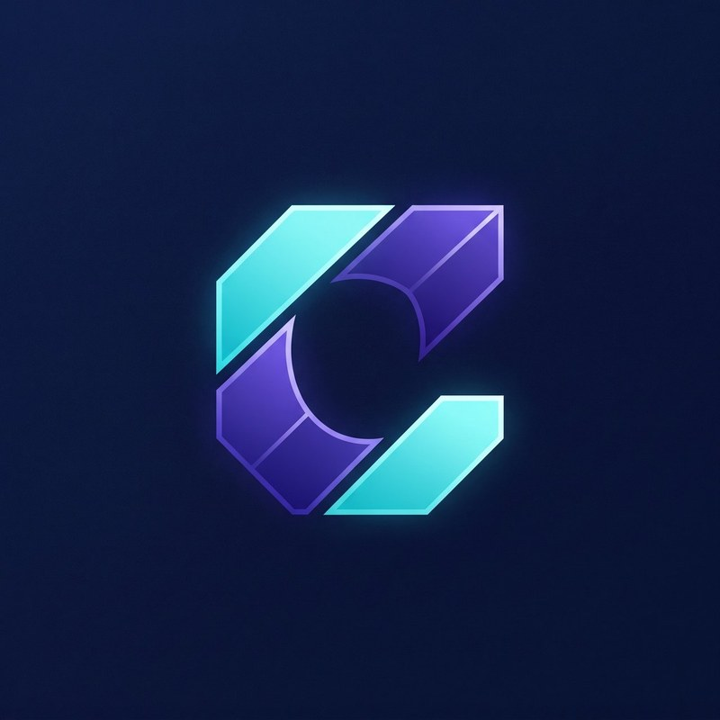

  

# Cygnal AI Studio
### Your AI workspace. Connected.

**Browse · Chat · Create · Automate**

A Windows desktop workspace that brings multi-browser productivity, cloud and local AI, knowledge management, automation, and notebook analysis together.

[Explore features](#a-connected-workspace) · [Downloads](https://github.com/DtsciSim/Cygnal-AI-Studio/releases) · [Report an issue](https://github.com/DtsciSim/Cygnal-AI-Studio/issues)

---

## A connected workspace

| Feature | What you can do |
| :--- | :--- |
| **Multi-browser workspace** | Work across up to four browser lanes (B1–B4), with flexible single, dual, triple, and quad layouts. Keep research, conversations, and supporting material side by side. |
| **Cygnal Chat** | Converse with configured AI models, manage chat history, attach files, and use supported research, image-generation, and artifact-preview modes. |
| **AI Refine** | Improve selected text: fix grammar, refine prompts, draft replies, change tone, shorten text, translate, or apply custom instructions. |
| **Local & offline AI** | Connect to Ollama and compatible self-hosted services. Use local-model chat, attachments, and saved sessions. Offline use requires locally available models and services; online features still need internet access. |
| **AI connections & routing** | Organize connection profiles, configure cloud APIs or custom endpoints, and assign suitable models to supported AI surfaces. Routing and retry options depend on the selected configuration. |
| **Agent Studio** | Run tool-assisted tasks with project folders, attachments, knowledge context, permissions, execution controls, and run history. |
| **Quick Agent** | Get focused help with prompts, research, page capture, notes, and supported browser workflows. |
| **Batch Runner / Canvas** | Build reusable multi-step workflows, manage runs, pause or resume supported tasks, and review outputs. |
| **Jupyter Data Lab** | Work in notebook cells with local kernels, datasets, charts, and package-management tools. Use guided AI assistance alongside analysis. |
| **Notes & knowledge** | Capture and organize notes, edit rich Markdown, use tables and equations, preview content, and export documents. Connect selected knowledge folders to AI workflows. |
| **Prompt library & methodologies** | Save and organize reusable prompts, compose instructions, use variables and text expansion, and send prompts to selected browser lanes. |
| **Prompt queues** | Queue prompts for ordered delivery to browser targets. |
| **Project file workspace** | Browse and organize files, use split views and pinned folders, and assign project folders to agent tasks. |
| **Grab & Relay** | Capture readable web content and move it between browser lanes or into notes, with supported export options. |
| **Workspace controls** | Manage downloads, history, backups, appearance, connections, and supporting runtime settings. |

## Cloud when you need it. Local when you choose it.

Use hosted AI connections or connect to compatible local services such as **Ollama, LM Studio, vLLM, llama.cpp, LocalAI, and Jan**. Connection support does not mean every model or provider supports every feature. Local servers and model downloads may require separate setup.

- Choose models and connections for supported parts of your workflow.
- Keep local-model conversations local when using a fully local configuration.
- Use cloud features deliberately: external requests follow your chosen provider and service settings.

## From research to results

1. **Browse** — gather context across multiple lanes.
2. **Think and write** — use Chat, AI Refine, and reusable prompts.
3. **Organize** — capture notes and manage project files.
4. **Execute** — use Agent Studio or repeatable batch workflows.
5. **Analyze** — explore datasets and visualizations in Jupyter Data Lab.

## Downloads

Windows installers will be distributed through [GitHub Releases](https://github.com/DtsciSim/Cygnal-AI-Studio/releases). This repository is not an installation package.

After an installer is published:

1. Open Releases and read the release-specific requirements and notes.
2. Download the installer attached to that release.
3. Install Cygnal and configure your preferred AI connections.
4. For local AI or notebooks, complete the relevant local runtime setup.

AI providers may require accounts, API keys, paid usage, or separate model downloads. Hardware requirements vary with the selected models and workloads. Feature availability depends on the installed version, provider capabilities, and runtime readiness. Experimental image features should be treated as beta.

## Feedback & support

Use [Issues](https://github.com/DtsciSim/Cygnal-AI-Studio/issues) for reproducible product bugs and feature requests. Include your Cygnal version, Windows version, a clear description, and safe reproduction steps.

**Do not post API keys, passwords, private documents, confidential logs, or personal information.** Redact screenshots and diagnostic details before sharing.

## About this repository

This is the public product-information and release hub for **Cygnal AI Studio**. It is not an open-source application repository. Application source code, internal implementation details, and private development materials are not published here. Application usage is governed by the terms provided with the product.
